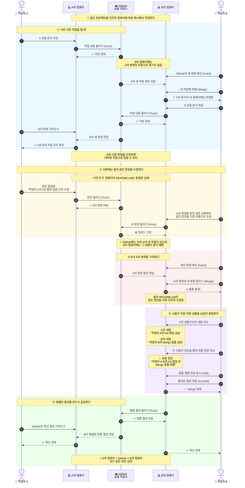

# 2026-git-start
## 📌 오늘의 실습 주제

오늘은 하나의 GitHub 저장소를 두 명의 작업자가 함께 사용하는 상황을 만들어
Git의 협업 과정을 실습했다.

실제 작업자는 한 명이지만 같은 GitHub 저장소를 두 개의 폴더에 Clone하여
**작업자 A와 작업자 B가 협업하는 상황**을 재현했다.

### 실습에서 배운 주요 내용

- 하나의 GitHub 저장소를 여러 작업자가 사용하는 방법
- `git fetch`로 다른 작업자의 변경 사항 확인하기
- `git merge`로 다른 작업자의 변경 사항 합치기
- Push가 거절되는 이유 이해하기
- Merge Conflict가 발생하는 이유 이해하기
- 충돌을 직접 해결하고 다시 Push하기
- 다른 작업자가 최종 결과를 동기화하는 방법


---

## 🏗️ 실습 구조

```text
          ☁️ GitHub
         공용 저장소
          ↕      ↕
     fetch/push  fetch/push
          ↕      ↕
    💻 작업자 A   💻 작업자 B
    로컬 저장소   로컬 저장소

```


