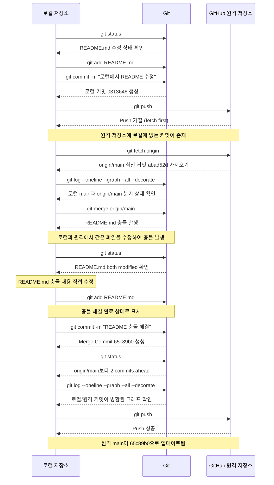

# 2026-git-start
clone test위한 저장소

로컬에서 readme 수정
git 충돌 test

충돌 수정 완료

```mermaid
sequenceDiagram
    participant Local as 로컬 저장소
    participant Git as Git
    participant Remote as GitHub 원격 저장소

    Local->>Git: git status
    Git-->>Local: README.md 수정 상태 확인

    Local->>Git: git add README.md
    Local->>Git: git commit -m "로컬에서 README 수정"
    Git-->>Local: 로컬 커밋 0313646 생성

    Local->>Remote: git push
    Remote-->>Local: Push 거절 (fetch first)
    Note over Local,Remote: 원격 저장소에 로컬에 없는 커밋이 존재

    Local->>Remote: git fetch origin
    Remote-->>Local: origin/main 최신 커밋 abad52d 가져오기

    Local->>Git: git log --oneline --graph --all --decorate
    Git-->>Local: 로컬 main과 origin/main 분기 상태 확인

    Local->>Git: git merge origin/main
    Git-->>Local: README.md 충돌 발생
    Note over Local,Git: 로컬과 원격에서 같은 파일을 수정하여 충돌 발생

    Local->>Git: git status
    Git-->>Local: README.md both modified 확인

    Note over Local: README.md 충돌 내용 직접 수정

    Local->>Git: git add README.md
    Note over Local,Git: 충돌 해결 완료 상태로 표시

    Local->>Git: git commit -m "README 충돌 해결"
    Git-->>Local: Merge Commit 65c89b0 생성

    Local->>Git: git status
    Git-->>Local: origin/main보다 2 commits ahead

    Local->>Git: git log --oneline --graph --all --decorate
    Git-->>Local: 로컬/원격 커밋이 병합된 그래프 확인

    Local->>Remote: git push
    Remote-->>Local: Push 성공
    Note over Local,Remote: 원격 main이 65c89b0으로 업데이트됨
```
